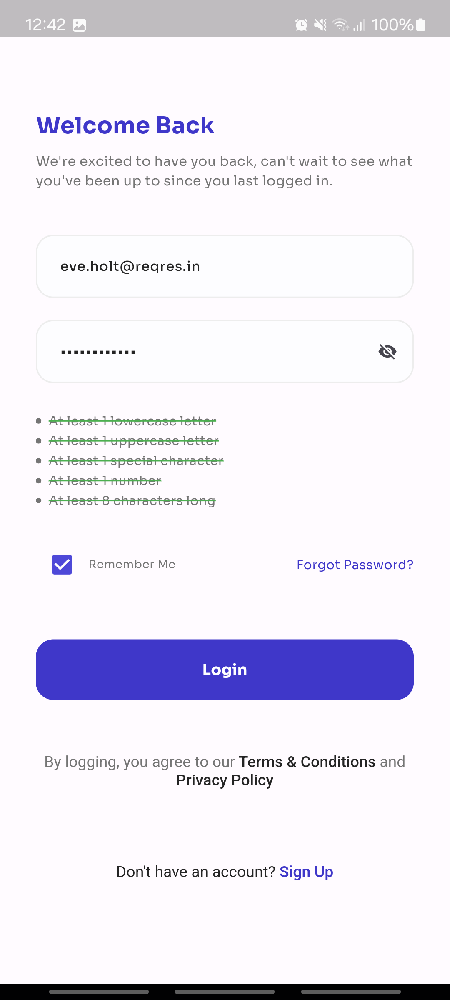
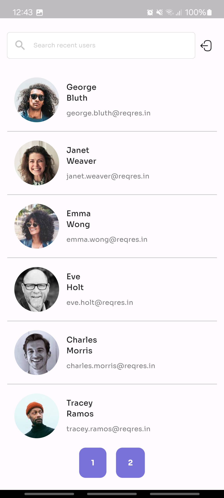
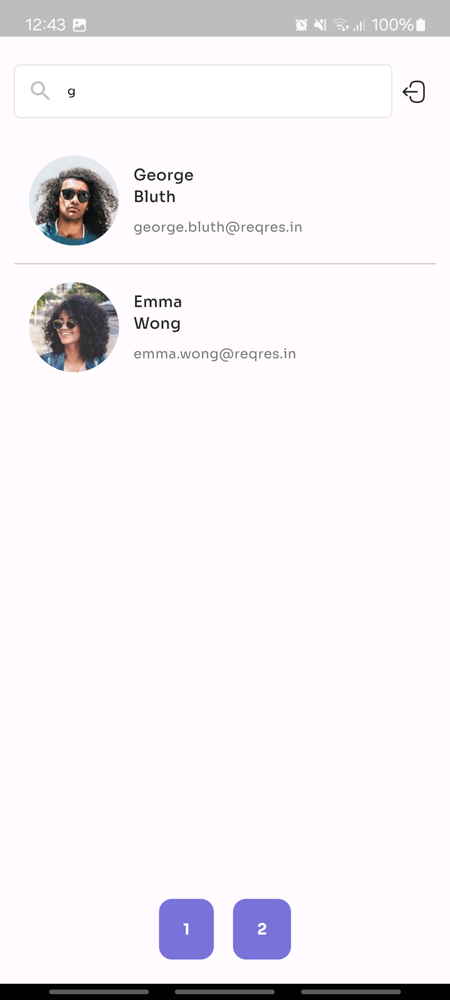
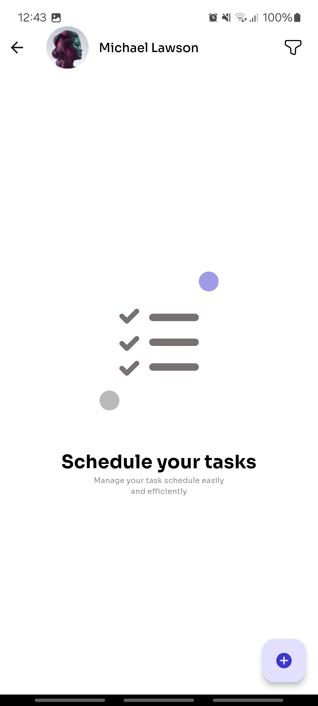
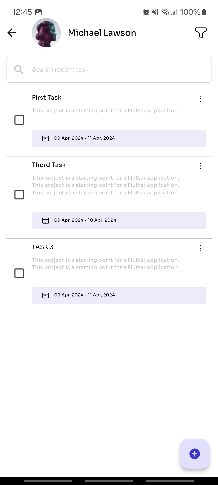
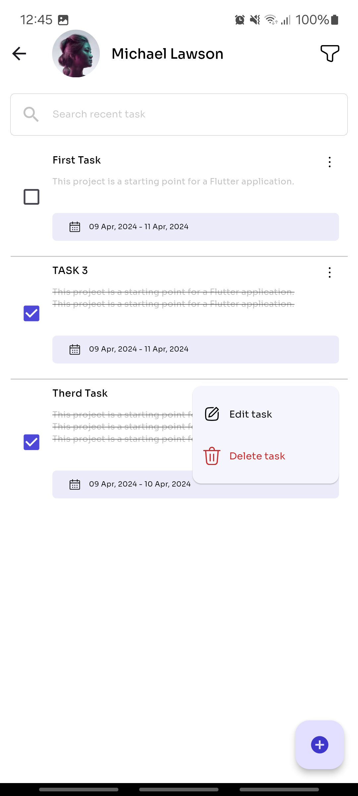
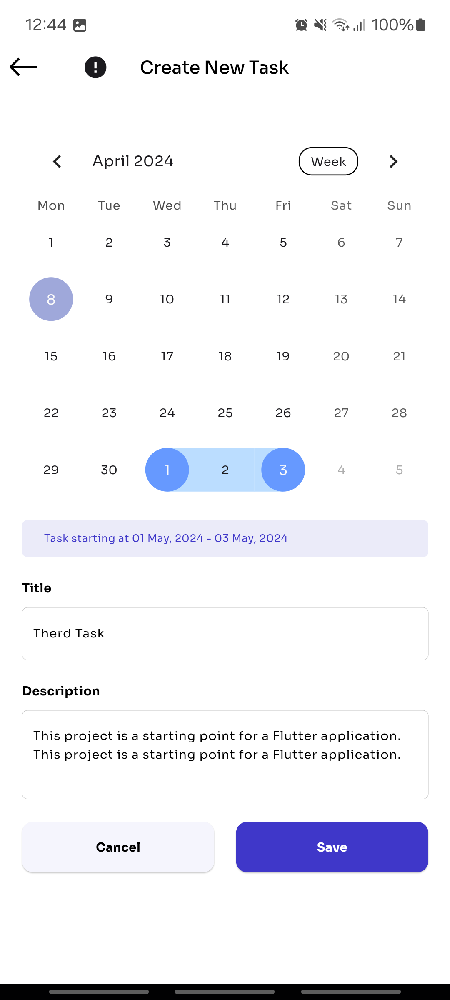
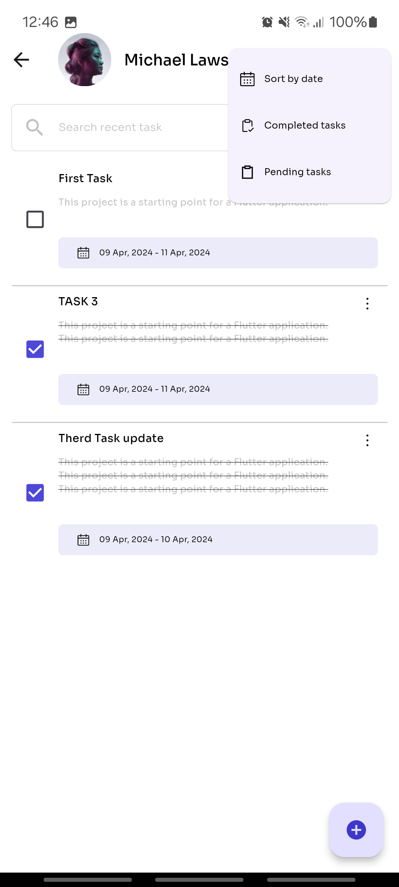

# Task Manager App

## Overview
This Flutter app serves as a task manager, empowering users to efficiently organize their tasks. It incorporates robust user authentication, seamless task management functionalities, efficient pagination, state management, local storage for persistent data, and comprehensive unit tests to ensure reliability.

## Instructions for Building and Running the App

This project is a starting point for a Flutter application. To get started:

1. Clone this repository git clone https://github.com/AbdoAnany/Task-Manager-App.git .
2. Ensure you have Flutter installed. If not, follow the installation instructions here.
3. Open the project directory in your preferred IDE or text editor.
4. Run flutter pub get to install dependencies.
5. Connect your device or start an emulator.
6. Run flutter run to build and launch the app on your device/emulator.

   
## Design Decisions

Design Decisions
* flutter_screenutil: Utilizing the flutter_screenutil package for responsive UI design was a deliberate choice. By using flutter_screenutil, the application can dynamically adjust its layout based on the screen size and resolution of the device. This ensures a consistent and visually appealing user experience across various devices, including smartphones and tablets.

* iconsax: The decision to use the iconsax icon library was made to enhance the visual aesthetics of the application. iconsax offers a wide range of modern and stylish icons that can be seamlessly integrated into the user interface. Leveraging this icon library helps in creating a visually appealing and cohesive design language throughout the application.

* table_calendar: Integrating the table_calendar package provides a robust solution for implementing a calendar view within the application. The table_calendar package offers customizable calendar widgets with features such as event highlighting, date selection, and month switching. By incorporating table_calendar, the application can effectively display and manage tasks or events in a calendar format, improving user productivity and organization.

## Additional Features Implemented
* Use flutter_screenutil to get responsive Design
* Iconsax for flutter (1000+ icons 6 diferent styles, total 6000+ icons).
* flutter_native_splash When your app is opened, there is a brief time while the native app loads Flutter. By default, during this time, the native app displays a

## Additional Resources

* Flutter Documentation: Offers tutorials, samples, guidance on mobile development, and a full API reference.
* Flutter Cookbook: Provides useful Flutter samples for various tasks and scenarios.
* Flutter Codelab: Step-by-step guide to writing your first Flutter app.
* Feel free to explore these resources to enhance your understanding of Flutter development.
  
## Splash Screen
    

## Login Screen
User Authentication: Secure user login via email and password using the /api/login endpoint from reqres.in.

example email: eve.holt@reqres.in 
password: Aa@12345

    

## Users Screen 
 Full CRUD functionality (Create, Read, Update, Delete) for tasks. Utilizes reqres.in endpoints such as /api/users for managing task data.
 Efficient pagination for handling a large number of tasks, leveraging the /api/users?page={page_number} endpoint.
 
  

## User Task Screen
Tasks are persisted locally using Flutter's shared preferences to ensure accessibility even when the app is closed and reopened.

     

## Add and Update Task Screen

  

