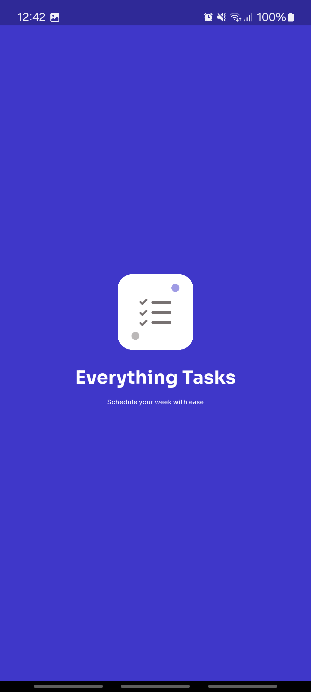
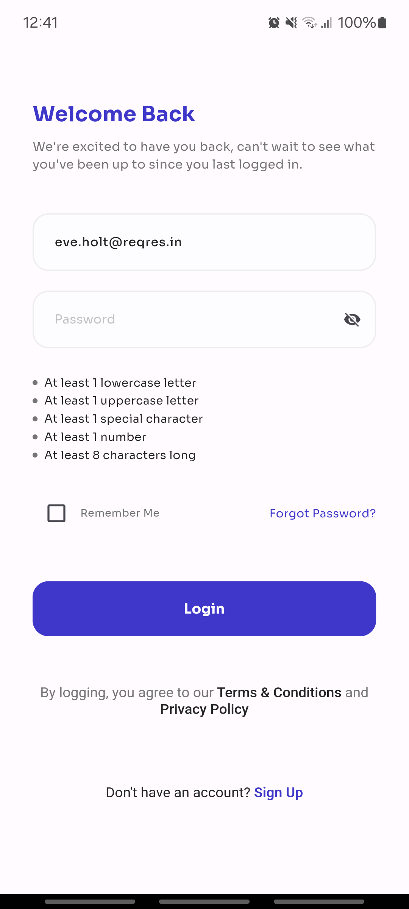

# Task Manager App

## Overview
This Flutter app serves as a task manager, empowering users to efficiently organize their tasks. It incorporates robust user authentication, seamless task management functionalities, efficient pagination, state management, local storage for persistent data, and comprehensive unit tests to ensure reliability.

## Instructions for Building and Running the App

This project is a starting point for a Flutter application. To get started:

1. Clone this repository to your local machine.
2. Ensure you have Flutter installed. If not, follow the installation instructions here.
3. Open the project directory in your preferred IDE or text editor.
4. Run flutter pub get to install dependencies.
5. Connect your device or start an emulator.
6. Run flutter run to build and launch the app on your device/emulator.

   
## Design Decisions
* Explain key design choices, such as the selection of state management pattern and local storage method.
* Justify the use of specific libraries or packages for certain functionalities.

## Challenges Faced
* Describe any hurdles encountered during the development process and how they were addressed.
* Highlight any particularly tricky aspects of implementation.

## Additional Features Implemented
* List any extra features beyond the specified requirements that were added to enhance the app's functionality or user experience.

## Additional Resources
* Flutter Documentation: Offers tutorials, samples, guidance on mobile development, and a full API reference.
* Flutter Cookbook: Provides useful Flutter samples for various tasks and scenarios.
* Flutter Codelab: Step-by-step guide to writing your first Flutter app.
* Feel free to explore these resources to enhance your understanding of Flutter development.
## Splash Screen

## Login Screen

